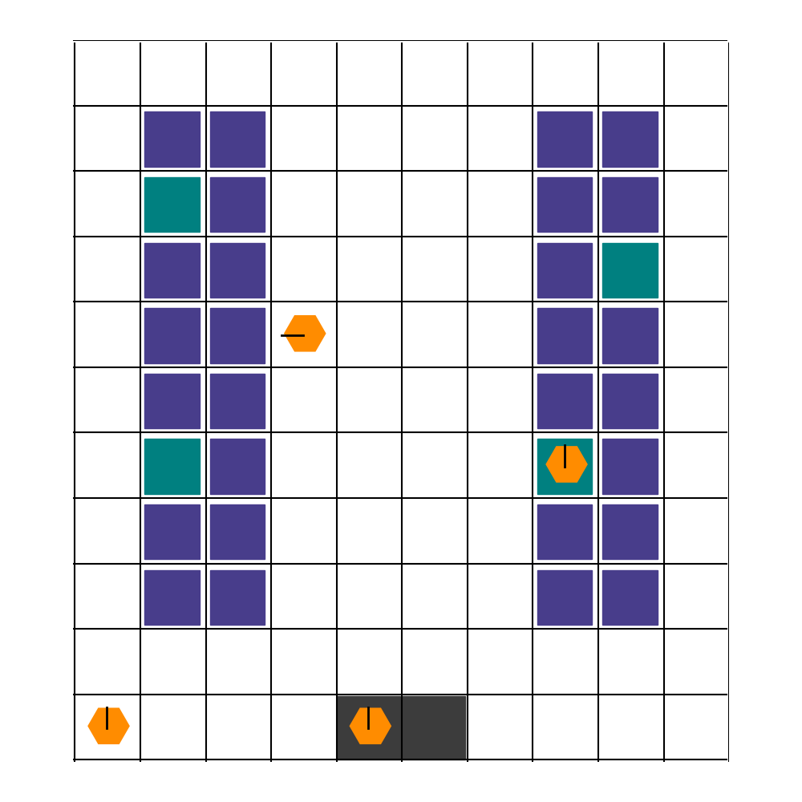
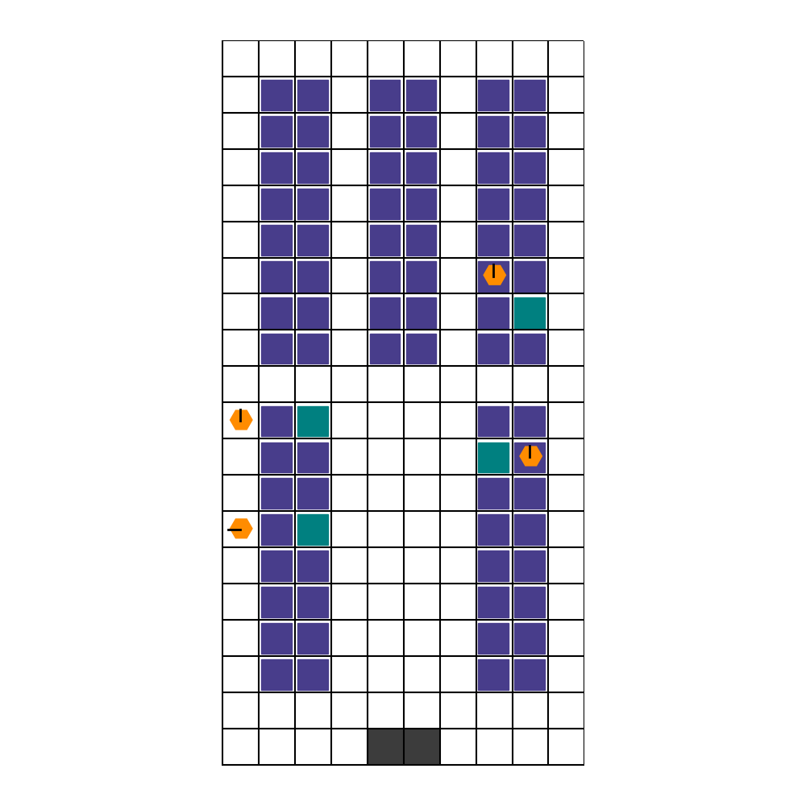
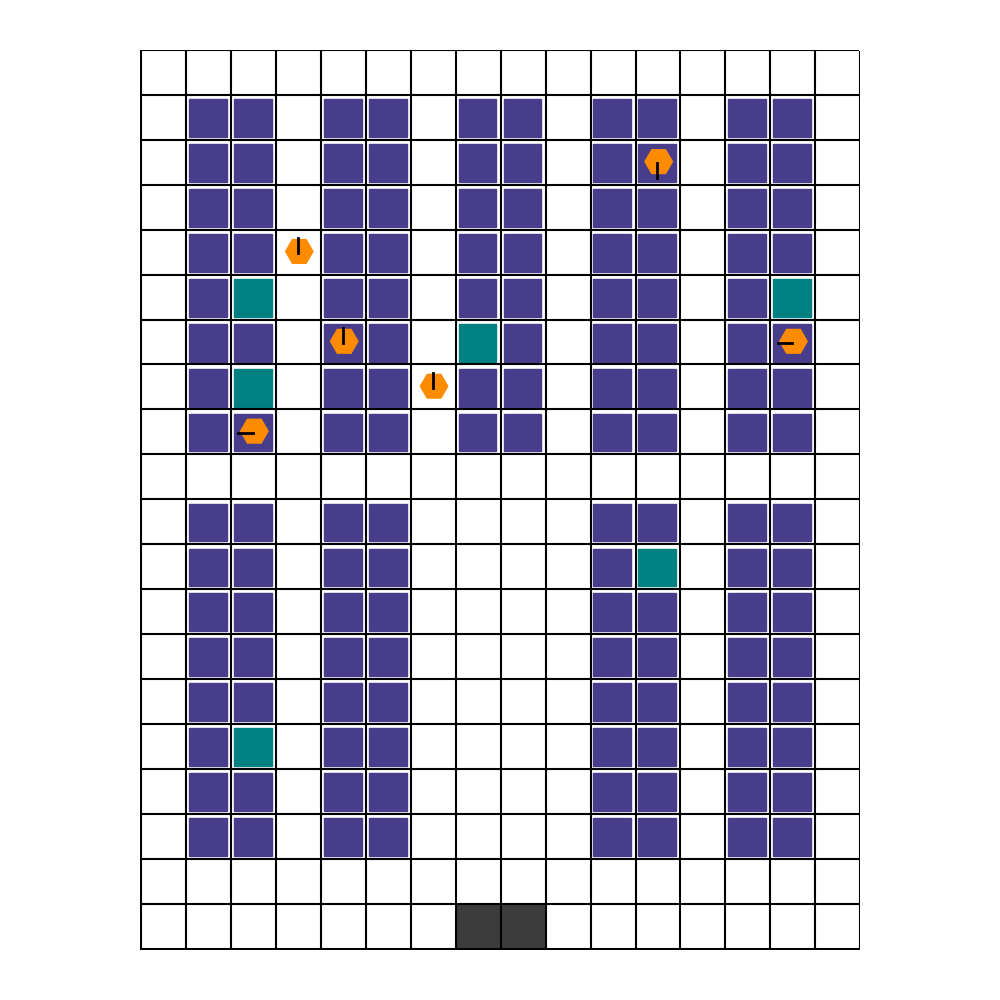

<h2 align="center">
    <p>Benchmarking of Multi Agent Reinforcement Learning in Robotic Warehouse</p>
</h2>

This repository contains the source code, execution scripts, and comparative analysis developed in this thesis to evaluate **Multi-Agent Reinforcement Learning (MARL)** algorithms within automated logistics environments. 

The primary objective of this study is to measure and benchmark the task performance, computational overhead, and generalization capabilities of **Transformer-based** architectures (such as MAT and SABLE) against traditional **PPO-based** paradigms (IPPO, MAPPO, MAGPO) using the partially observable **RWARE** robotic warehouse simulator.


## 📌 Table of Contents

* [1. Introduction](#-introduction)
  * [Evaluated Algorithms](#evaluated-algorithms)
  * [RWARE Simulator](#rware-simulator)
  * [Key Research Questions](#key-research-questions)
* [2. Installation](#-installation)
* [3. Experiments & Results](#-experiments--results)
  * [Base Performance](#base-performance)
  * [Transfer Learning](#transfer-learning)
  * [Zero-Shot Generalization to Map Size](#zero-shot-generalization-to-map-size)
  * [Zero-Shot Generalization to Agent Counts](#zero-shot-generalization-to-agent-counts)
  * [Deactivation of Memory](#deactivation-of-memory)
  * [Visual Rollouts of Top Performing Models](#visual-rollouts-of-top-performing-models)
* [4. Conclusions](#-conclusions)
* [5. Future Work](#-future-work)
* [6. References](#-references)

## 📖 Introduction
The increasing deployment of autonomous agents for task automation is driving the need to discover and develop robust and scalable multi-agent solutions. Recent advancements in Multi-Agent Reinforcement Learning (MARL) have led to the design of frameworks that solve cooperative problems within groups of coordinated agents. However, traditional approaches often struggle with non-stationarity and partial observability. This thesis evaluates state-of-the-art MARL algorithms within a robotic warehouse logistics context (RWARE), a partially observable environment where each agent can only observe a small fraction of the warehouse.

The evaluation focuses on the performance of Transformer-based architectures compared to established paradigms, such as Centralized Training with Decentralized Execution (CTDE) and Independent Reinforcement Learning (IRL). The main goal of this study is to analyze the trade-offs between task performance and resource consumption. Furthermore, the research investigates the Zero-shot Generalization of Transformer-based models, measuring their ability to transfer learned policies from a small-scale to large-scale warehouses without additional training.

This work aims to determine whether Transformer mechanisms can mitigate the scalability limits of current MARL methods. This evaluation seeks to provide a clear benchmark for selecting architectures that balance operational efficacy with computational cost in complex logistical systems.

---

### Evaluated Algorithms
To understand the impact of architectural choices on multi-agent coordination, we evaluate two distinct paradigms: **PPO-based** baselines and **Transformer-based** architectures. 

A key architectural distinction across these models is how they handle temporal information. Several algorithms offer both a **Feed-Forward (FF)** version for reactive behaviors and a **Recurrent/Memory (REC)** version designed to handle partial observability. However, their underlying mechanisms differ:
* **IPPO and MAPPO (REC):** Implement temporal memory using standard **GRU** modules.
* **MAGPO and SABLE (REC):** Manage temporal dependencies by processing and passing **hidden states** natively through their architectures instead of relying on traditional recurrent networks.

The algorithms, along with their respective script implementations in this repository, are categorized as follows:
<div align="center">

<table>
  <thead>
    <tr>
      <th align="left">Paradigm</th>
      <th align="left">Algorithm</th>
      <th align="left">FF Version Script</th>
      <th align="left">REC Version Script</th>
    </tr>
  </thead>
  <tbody>
    <tr>
      <td rowspan="3"><b>PPO-based</b></td>
      <td>IPPO</td>
      <td><code>ff_ippo.py</code></td>
      <td><code>rec_ippo.py</code></td>
    </tr>
    <tr>
      <td>MAPPO</td>
      <td><code>ff_mappo.py</code></td>
      <td><code>rec_mappo.py</code></td>
    </tr>
    <tr>
      <td>MAGPO</td>
      <td>-</td>
      <td><code>rec_magpo.py</code></td>
    </tr>
    <tr>
      <td rowspan="2"><b>Transformer</b></td>
      <td>MAT</td>
      <td><code>mat.py</code></td>
      <td>-</td>
    </tr>
    <tr>
      <td>SABLE</td>
      <td><code>ff_sable.py</code></td>
      <td><code>rec_sable.py</code></td>
    </tr>
  </tbody>
</table>

</div>

#### 1. PPO-Based Baselines
* **IPPO (Independent PPO):** A decentralized approach where each agent learns its own policy independently, treating other agents as part of the environment.
* **MAPPO (Multi-Agent PPO):** Incorporates the Centralized Training with Decentralized Execution (CTDE) framework, utilizing a shared centralized critic to guide individual agent updates.
* **MAGPO:** A framework based on a Teacher-Student architecture, where a centralized "teacher" policy guides and distills knowledge into decentralized "student" policies to improve coordination and training efficiency.

#### 2. Transformer-Based Architectures
* **MAT (Multi-Agent Transformer):** Reinterprets MARL as a sequence-to-sequence problem, framing multi-agent policy generation as a sequential decision-making process via Transformer blocks.
* **SABLE:** An optimized Transformer variant for multi-agent environments that integrates Retentive Networks (RetNet). It leverages specialized retention mechanisms to handle long-horizon dependencies through efficient hidden-state processing, bypassing the limitations of classic recurrent layers.

---

### RWARE Simulator

The **Robotic Warehouse (RWARE)** simulator utilized in this project is the Jumanji library implementation. It replicates demand-driven, automated mobile-robot fulfillment centers where multiple agents must cooperate to locate specific shelves, deliver them to workstations, and return them under strict spatial constraints.

Here is an example of the environment in action:

<!-- Replace the source path below with your actual gif/video path in your repo -->
<p align="center">
  
</p>


#### Environment Elements & Color Coding
The warehouse map is a grid system that varies depending on the configuration. The layout features the following distinct elements:

*   **White Cells (Highways):** Open roads where agents can move freely without restrictions.
*   **Blue Squares (Standard Shelves):** Stationary storage racks that do not currently contain requested items.
*   **Green Squares (Target Shelves):** Requested shelves containing packages that must be picked up and delivered.
*   **Grey Squares (Workstations):** The delivery stations. Bringing a green shelf here completes a delivery task.
*   **Orange/Red Squares (Robotic Agents):** The MARL agents. They are **Orange** when moving freely and turn **Red** when carrying a shelf. By default, agents have a limited field of view, seeing only **1 cell away** in every direction (a $3 \times 3$ grid around them).


#### Simulation Logic & Constraints
1.  **Initialization:** Agents spawn at random locations at the start of an episode.
2.  **The Pickup Phase:** Agents can navigate anywhere to find and lift a Green Shelf. 
3.  **The Delivery Phase:** Once an agent loads a shelf, its movement is heavily restricted. It cannot cross cells occupied by other shelves and must navigate strictly through the Highways.
4.  **The Reset Loop:** When a shelf reaches the workstation, the task is completed, that shelf turns blue, and a new random blue shelf turns green elsewhere.
5.  **The Unload Constraint:** Agents cannot drop shelves on highway cells, they must return and unload them into valid shelf grid positions before picking up a new one.
6.  **Episode Termination:** To prevent infinite loops, episodes are hard-capped at 500 steps. Additionally, this Jumanji version strictly terminates the simulation immediately if a collision occurs between agents.

#### Reward Structure
RWARE is characterized by **extremely sparse, global, and shared rewards**:
*   A cooperative reward of **$+1$** is given to **all agents** simultaneously only when a target shelf is successfully delivered to a workstation.
*   Returning the empty shelf back to a legal grid cell is a required behavioral loop, but it yields **no immediate reward**.
*   There are no intermediate shaping rewards or negative step penalties.

#### Action Space
Each agent executes discrete decisions chosen from an individual action space of **5 valid actions**:

| Action ID | Action Name | Description |
| :---: | :--- | :--- |
| **0** | `No-Op` | The agent remains stationary during this time step. |
| **1** | `Turn Clockwise` | Rotates the agent's facing direction 90° to the right. |
| **2** | `Turn Counter-Clockwise` | Rotates the agent's facing direction 90° to the left. |
| **3** | `Forward` | Moves the agent one cell ahead in its current direction. |
| **4** | `Load / Unload` | **Loads** a shelf if standing on its cell (turning red), or **unloads** a carried shelf into a valid rack slot (turning orange). |

#### Observation Space
Each agent receives a flattened numerical vector containing **66 elements**, representing its own state and its $3 \times 3$ localized field of view (where the agent occupies the center cell):

*   **Agent State (Positions 1 to 8):**
    *   `2 integers`: Current coordinates $(X, Y)$.
    *   `1 binary`: Load status ($1$ if carrying a shelf, $0$ otherwise).
    *   `4 binaries`: One-hot encoded facing direction (North, South, East, West).
    *   `1 binary`: Highway status ($1$ if currently on a white cell, $0$ otherwise).
*   **Adjacent Cells Agents Data (Positions 9 to 48):**
    *   For each of the 8 visible adjacent cells, a 5-element block details:
        *   `1 binary`: Presence of another agent.
        *   `4 binaries`: One-hot encoded direction of that neighbor agent (all zeros if no agent is present).
*   **Adjacent Cells Shelves Data (Positions 49 to 66):**
    *   For the 9 cells in the field of view, a 2-element block details:
        *   `1 binary`: Presence of a shelf.
        *   `1 binary`: Status of the shelf ($1$ if it is a target/green shelf).

---

### Key Research Questions 
This benchmark is designed to answer critical questions regarding the current state of MARL:

1. **Performance & Scaling**: Which algorithmic paradigm performs better under tight coordination constraints and scaling agent counts?

2. **Transfer Learning**: Is transfer learning an effective and efficient approach to accelerate model training in warehouse environments?

3. **Zero-Shot Generalization**: Are modern MARL architectures capable of handling zero-shot generalization when environment factors (like grid size or agent density) change?


## 💻 Installation

## 📊 Experiments & Results

### Base Performance

In this experiment, we train all the algorithms from scratch under identical hyperparameter settings to evaluate their fundamental performance in the following environments: `tiny-2ag`, `tiny-4ag`, `small-4ag`, `medium-4ag` and `medium-6ag`. 

The table below displays the average number of delivered packages during inference:
<div align="center">

<table>
  <thead>
    <tr>
      <th align="right">Alg. \ Env.</th>
      <th align="right">tiny-2ag</th>
      <th align="right">tiny-4ag</th>
      <th align="right">small-4ag</th>
      <th align="right">medium-4ag</th>
      <th align="right">medium-6ag</th>
    </tr>
  </thead>
  <tbody>
    <tr>
      <td><b>ff ippo</b></td>
      <td align="right">13,14</td>
      <td align="right">14,48</td>
      <td align="right">5,85</td>
      <td align="right">3,39</td>
      <td align="right">0</td>
    </tr>
    <tr>
      <td><b>rec ippo</b></td>
      <td align="right">0,03</td>
      <td align="right">16,87</td>
      <td align="right">0,01</td>
      <td align="right">0</td>
      <td align="right">7,07</td>
    </tr>
    <tr>
      <td><b>ff mappo</b></td>
      <td align="right">14,67</td>
      <td align="right">18,97</td>
      <td align="right">6,79</td>
      <td align="right">4,18</td>
      <td align="right">5,08</td>
    </tr>
    <tr>
      <td><b>rec mappo</b></td>
      <td align="right">17,42</td>
      <td align="right">19,45</td>
      <td align="right">4,05</td>
      <td align="right">0</td>
      <td align="right">0,01</td>
    </tr>
    <tr>
      <td><b>rec magpo</b></td>
      <td align="right">1,98</td>
      <td align="right">21,37</td>
      <td align="right">0,03</td>
      <td align="right">0</td>
      <td align="right">0,02</td>
    </tr>
    <tr>
      <td><b>mat</b></td>
      <td align="right">15,81</td>
      <td align="right">22,66</td>
      <td align="right">13,24</td>
      <td align="right">8,4</td>
      <td align="right">5,62</td>
    </tr>
    <tr>
      <td><b>ff sable</b></td>
      <td align="right">16,27</td>
      <td align="right">27,34</td>
      <td align="right">7,81</td>
      <td align="right">0,02</td>
      <td align="right">0,33</td>
    </tr>
    <tr>
      <td><b>rec sable</b></td>
      <td align="right">16,97</td>
      <td align="right">25,07</td>
      <td align="right">4,92</td>
      <td align="right">0</td>
      <td align="right">0,01</td>
    </tr>
  </tbody>
</table>

</div>

* **Tiny Environments & Agent Density:** The `tiny` layout is simple enough for almost all paradigms to learn effectively. Scaling from 2 to 4 agents boosts performance across the board because doubling the robot density accelerates exploration and localized reward discovery. 
* **Transformer Coordination Advantage:** Transformer-based architectures significantly outclass classical models under high-density constraints. When doubling the agent count in `tiny`:
  * **MAT and SABLE** achieve a massive **40% to 70% performance surge**.
  * **IPPO and MAPPO** only show a modest **10% to 30% improvement**.
  This gap highlights the Transformers' superior spatial coordination, allowing them to optimize delivery routes while actively preventing collisions in congested corridors.
* **The Anomalous Case of PPO + Memory:** `rec ippo` and `rec magpo` fail completely with 2 agents in `tiny` maps but match the baseline average with 4 agents (positioning `rec magpo` as the top-performing PPO variant in `tiny-4ag`). This behavior suggests that higher agent density is mandatory for these specific memory architectures to trigger successful initial exploration.
* **The Exploration Bottleneck in Small Maps:** Scaling up to `small` layouts triggers a steep performance drop. **MAT stands out as the only architecture maintaining an acceptable delivery rate**. Standard recurrent models (with GRU or memory blocks) suffer severe performance deterioration here compared to their feed-forward counterparts. This likely  indicates a credit-assignment failure: due to delayed rewards in larger search spaces, the memory blocks wrongly associate long historical trajectories with low-value or useless states.
* **Medium Map Dynamics & Scalability Boundaries:** In `medium` environments, the performance of all memory-centric models alongside `ff sable` collapses close to zero. However, critical structural patterns emerge among the remaining baselines:
  * **IPPO:** Achieves minor success with 4 agents but drops to zero with 6, since treating independent agents as environmental noise compounds complexity exponentially as numbers grow.
  * **MAPPO:** Mitigates this breakdown through its shared centralized critic. Elevating the agent count increases the simulation context, yielding slightly superior results.
  * **MAT:** Dominates the 4-agent variant but experiences a coordination bottleneck with 6 agents, equalizing its final score with MAPPO.
  * **rec ippo (Anomaly):** Behaves erratically, failing completely with 4 agents but outperforming the rest of the algorithms with 6 agents. This reinforces the hypothesis that high agent density is the primary driver for successful exploration in memory-recurrent baselines.


The following table records the absolute training execution times for each algorithm across the evaluated simulator configurations:
<div align="center">

<table>
  <thead>
    <tr>
      <th align="right">Alg. \ Env.</th>
      <th align="right">tiny-2ag</th>
      <th align="right">tiny-4ag</th>
      <th align="right">small-4ag</th>
      <th align="right">medium-4ag</th>
      <th align="right">medium-6ag</th>
    </tr>
  </thead>
  <tbody>
    <tr>
      <td><b>ff ippo</b></td>
      <td align="right">0:09:37</td>
      <td align="right">0:10:42</td>
      <td align="right">0:14:37</td>
      <td align="right">0:19:36</td>
      <td align="right">0:21:11</td>
    </tr>
    <tr>
      <td><b>rec ippo</b></td>
      <td align="right">0:17:01</td>
      <td align="right">0:19:26</td>
      <td align="right">0:22:36</td>
      <td align="right">0:28:43</td>
      <td align="right">0:31:01</td>
    </tr>
    <tr>
      <td><b>ff mappo</b></td>
      <td align="right">0:09:35</td>
      <td align="right">0:10:38</td>
      <td align="right">0:14:49</td>
      <td align="right">0:20:31</td>
      <td align="right">0:21:40</td>
    </tr>
    <tr>
      <td><b>rec mappo</b></td>
      <td align="right">0:17:29</td>
      <td align="right">0:18:42</td>
      <td align="right">0:22:35</td>
      <td align="right">0:27:35</td>
      <td align="right">0:31:33</td>
    </tr>
    <tr>
      <td><b>rec magpo</b></td>
      <td align="right">0:17:54</td>
      <td align="right">0:21:48</td>
      <td align="right">0:25:27</td>
      <td align="right">0:30:07</td>
      <td align="right">0:36:12</td>
    </tr>
    <tr>
      <td><b>mat</b></td>
      <td align="right">0:13:24</td>
      <td align="right">0:16:10</td>
      <td align="right">0:19:51</td>
      <td align="right">0:25:34</td>
      <td align="right">0:27:57</td>
    </tr>
    <tr>
      <td><b>ff sable</b></td>
      <td align="right">0:13:23</td>
      <td align="right">0:15:34</td>
      <td align="right">0:19:33</td>
      <td align="right">0:24:37</td>
      <td align="right">0:27:48</td>
    </tr>
    <tr>
      <td><b>rec sable</b></td>
      <td align="right">0:13:49</td>
      <td align="right">0:17:12</td>
      <td align="right">0:20:51</td>
      <td align="right">0:25:37</td>
      <td align="right">0:31:01</td>
    </tr>
  </tbody>
</table>

</div>

* **Map Size Penalty:** As the simulator complexity scales, training times increase significantly. Map dimensions act as the primary computational bottleneck due to the intense model-environment interaction loop, which inherently decreases the steps-per-second (SPS) processing throughput.
* **Algorithmic Overhead:** Classical, feed-forward PPO baselines remain the fastest configurations. However, introducing recurrent memory layers inflicts a massive temporal penalty. Overall, **MAGPO** emerges as the most computationally expensive architecture. 
* **The Transformer Sweet Spot:** Transformer-based models manage a well-balanced computational profile. While marginally slower than reactive, feed-forward PPO networks, they execute significantly faster than traditional recurrent baseline architectures (GRU-based models).

#### Execution & Replication Script
To replicate these baseline experiments, use the following execution template.

```bash
export XLA_PYTHON_CLIENT_ALLOCATOR=platform

python mava/systems/mat/anakin/mat.py \
    env=rware \
    env/scenario=tiny-2ag \
    logger.loggers.tensorboard.enabled=true \
    logger.loggers.json.enabled=true \
    logger.checkpointing.save_model=true \
    logger.checkpointing.save_args.save_interval_steps=10 \
    arch.num_envs=32 \
    arch.num_evaluation=244 \
    arch.num_absolute_metric_eval_episodes=640 \
    system.num_updates=2000
```

The first line is instructions to prevent JAX from pre-allocating 90% of the GPU VRAM. Given our hardware resources, this parameter was mandatory to avoid system deadlocks. The rest of the command handles the execution of the selected algorithm, which in this example is MAT utilizing the Anakin architecture. The subsequent configuration variables manage the environment setup, logging, and hyperparameters.

For this specific performance test, the only variable modified between runs is `env/scenario` to swap the map configuration. During the training process, 32 environment scenarios are run simultaneously, the policy is evaluated 244 times, and the network is updated a total of 2000 times. Finally, to test the model's inference, 640 evaluation episodes are run.

---

### Transfer learning
This section analyzes the impact of transferring knowledge across different warehouse configurations. The evaluation tracks how policies trained in smaller layouts scale up to more complex environments.

>❗This transfer learning analysis excludes `rec ippo` and `rec magpo` due to poor initial performance in tiny layouts.

>❗A strict requirement for transfer learning is that the number of network parameters must be completely independent of the number of agents. This rule makes MAPPO structurally incompatible because its centralized critic network grows proportionally with the agent count. This variation prevents a pretrained 2 agent model from loading into a 4 agent environment.

The following tables showcase the average reward achieved when training from scratch compared to initializing the weights with prior knowledge.

<div align="center">
<div style="display: flex; flex-wrap: wrap; gap: 20px; justify-content: center; max-width: 1200px;">
<!-- ROW 1 - BLOCK 1: TINY 4AG -->
<div style="flex: 1; min-width: 45%; max-width: 48%;" valign="top">

#### Tiny Layout (4 Agents)
Models are initialized using weights from the tiny 2ag environment.

| Alg. \ Exp. | Base Performance | Transfer Learning |
| :--- | :---: | :---: |
| ff ippo | 14.48 | 23.47 |
| mat | 22.66 | 27.38 |
| ff sable | 27.34 | 34.01 |
| rec sable | 25.07 | 35.64 |

</div>

<!-- ROW 1 - BLOCK 2: SMALL 4AG -->
<div style="flex: 1; min-width: 45%; max-width: 48%;" valign="top">

#### Small Layout (4 Agents)
Models are initialized using weights from the previously retrained tiny 4ag environment.

| Alg. \ Exp. | Base Performance | Transfer Learning |
| :--- | :---: | :---: |
| ff ippo | 5.85 | 0.00 |
| mat | 13.24 | 17.49 |
| ff sable | 7.81 | 0.00 |
| rec sable | 4.92 | 21.54 |

</div>

<!-- ROW 2 - BLOCK 1: MEDIUM 4AG -->
<div style="flex: 1; min-width: 45%; max-width: 48%; margin-top: 10px;" valign="top">

#### Medium Layout (4 Agents)
Models are initialized selectively based on the best results from the small 4ag phase. `ff ippo` and `ff sable` load their base configurations while `mat` and `rec sable` load their TL weights.

| Alg. \ Exp. | Base Performance | Transfer Learning |
| :--- | :---: | :---: |
| ff ippo | 3.39 | 7.49 |
| mat | 8.40 | 12.94 |
| ff sable | 0.02 | 11.34 |
| rec sable | 0.00 | 16.71 |

</div>

<!-- ROW 2 - BLOCK 2: MEDIUM 6AG -->
<div style="flex: 1; min-width: 45%; max-width: 48%; margin-top: 10px;" valign="top">

#### Medium Layout (6 Agents)
Models are initialized using weights directly from the medium 4ag transfer learning phase.

| Alg. \ Exp. | Base Performance | Transfer Learning |
| :--- | :---: | :---: |
| ff ippo | 0.00 | 11.21 |
| mat | 5.62 | 18.10 |
| ff sable | 0.33 | 17.97 |
| rec sable | 0.01 | 25.30 |

</div>
</div>
</div>

* **Tiny 4ag Environments:** Significant performance spikes appear across all models. Initializing weights via tiny 2ag yields a 60% performance boost for `ff ippo`, matching the baseline of Transformer architectures. The memory version of SABLE improves by over 40%, ranking first for this configuration.

* **Small 4ag Environments:** Results reveal a high degree of instability. Both `ff ippo` and `ff sable` fail to learn entirely. This suggests that, given an overfitted model, feed-forward architectures are too rigid to explore and find a good policy (more information in the [Overfitting to Map Size](#overfitting-to-map-size) section). Conversely, `mat` and `rec sable` successfully leverage prior knowledge, with `rec sable` gaining over 15 reward points.

* **Medium 4ag Environments:** Every single algorithm successfully outperforms its respective baseline. While `ff ippo` doubles its score, it remains the lowest performing option. `mat` yields a steady but moderate improvement due to its high initial baseline. Both SABLE architectures jump from a baseline of zero to remarkable performance levels, especially the recurrent version.

* **Medium 6ag Environments:** While `mat` was the only algorithm capable of scoring above zero from scratch, transfer learning enables every model to surpass the 10 point threshold. `rec sable` achieves the highest reward by a wide margin, proving that weight initialization gives memory structures an outstanding training advantage.

The next charts show the reward evolution through the training evaluations:

<p align="center">
  
  
  <br>
  
  
</p>

* **ff ippo:** The environment complexity prevents standard learning. Without weight initialization, exploration fails completely to discover rewarding states. Transfer learning starts the policy at a reward near 10 and maintains a slight positive trend above that value.

* **mat:** Demonstrates exceptional exploration across all three training modes. The transfer learning curve starts high at 15 points and grows gradually to 18. Intensive training shows an abrupt learning spike after checkpoint 100 followed by a plateau, eventually converging logarithmically with the transfer learning results. Base training shows the same behavior as intensive training but at a slower pace. This implies that with more iterations all three training approaches would eventually converge to the same results.

* **ff sable:** Exhibits dynamics similar to MAT. The transfer learning run starts near 15 and increases steadily to 18. Intensive training triggers a linear improvement after checkpoint 50 to match the TL score. The base run delays its learning until checkpoint 250, indicating that it would require significantly more iterations to converge.

* **rec sable:** Faces notable exploration bottlenecks when training from scratch. The transfer learning run starts at 20 points and scales up to 26, showing the highest growth rate. Intensive training remains flat until checkpoint 170 before climbing linearly past 18 points. The base training only begins to learn around checkpoint 350, highlighting a severe dependency on heavy compute resources.

#### Execution & Replication Script
To replicate these experiments, use the following execution template.

```bash
export XLA_PYTHON_CLIENT_ALLOCATOR=platform

python mava/systems/ppo/anakin/ff_ippo.py \
  env=rware \
  env/scenario=tiny-4ag \
  logger.loggers.tensorboard.enabled=true \
  logger.loggers.json.enabled=true \
  logger.checkpointing.load_model=true \
  logger.checkpointing.load_args.checkpoint_uid="tiny_2ag" \
  logger.checkpointing.save_model=true \
  logger.checkpointing.save_args.save_interval_steps=10 \
  arch.num_envs=32 \
  arch.num_evaluation=244 \
  arch.num_absolute_metric_eval_episodes=640 \
  system.num_updates=2000
```

This script handles the execution of the selected algorithm, which in this example is `ff ippo` utilizing the Anakin architecture. The key configuration variables are `logger.checkpointing.load_model=true` and `logger.checkpointing.load_args.checkpoint_uid="tiny_2ag"` which are required to load an existing model structure and initialize the training network parameters.

---

### Zero-Shot Generalization to Map Size
This section evaluates the generalization capabilities of trained policies when deployed directly into larger environment layouts without any intermediate training or weight fine tuning.

The following tables present the performance when testing models under Zero-shot conditions. They compare the standard Base Performance and the Transfer Learning (TL) results against the Zero Shot Generalization.

<div align="center">
<div style="display: flex; gap: 20px; flex-wrap: wrap;">
<div style="flex: 1; min-width: 300px;" valign="top">

#### Evaluation on Small Layout (4 Agents)
Inference conducted using weights directly trained in the tiny 4ag environment.

| Alg. \ Exp. | Base | TL | Zero-Shot |
| :--- | :---: | :---: | :---: |
| ff ippo | 5.85 | 0.00 | 0.00 |
| mat | 13.24 | 17.49 | 3.03 |
| ff sable | 7.81 | 0.00 | 0.00 |
| rec sable | 4.92 | 21.54 | 0.49 |

</div>

<div style="flex: 1; min-width: 300px;" valign="top">

#### Evaluation on Medium Layout (4 Agents)
Inference conducted using weights directly trained in the small 4ag environment.

| Alg. \ Exp. | Base | TL | Zero-Shot |
| :--- | :---: | :---: | :---: |
| ff ippo | 3.39 | 7.49 | 1.01 |
| mat | 8.40 | 12.94 | 0.18 |
| ff sable | 0.02 | 11.34 | 1.16 |
| rec sable | 0.00 | 16.71 | 0.36 |

</div>
</div>
</div>


* **Scaling from Tiny to Small Layouts:** Both `ff ippo` and `ff sable` experience a complete performance collapse yielding zero rewards. This outcome aligns with previous findings where transferring knowledge between these specific setups also failed. Conversely, `rec sable` manages to complete occasional package deliveries. While this score remains low, it indicates the presence of shared cross environment navigation patterns. The MAT algorithm scores low, but its result remains close to the base performance of `ff_ipp` and `rec_sable`.

* **Scaling from Small to Medium Layouts:** Every tested architecture scores average rewards above zero, but remains strictly below the two point threshold. Although these models cannot operate optimally without dedicated retraining, the ability to secure occasional package deliveries confirms that they retain useful foundational behaviors and operational patterns. This survival of baseline skills directly explains why these models achieve such high acceleration during the transfer learning phases.

#### Overfitting to Map Size
Specific isolation tests are conducted to evaluate why `ff ippo` and `ff sable` experience a complete performance collapse when shifting from a `tiny 4ag` environment to a small 4ag layout. 

The original transfer learning pipeline initializes the network using the absolute best weights obtained during the `tiny 4ag` transfer phase. This setup corresponds to loading parameters from the **TL** column to produce the rewards under the **TL1** column. To analyze the underlying learning mechanics, this experiment introduces an alternative route: initializing the networks using weights from the raw baseline training instead. This process corresponds to loading parameters from the **Base** column of the tiny layout to produce the results under the **TL2** column.

<div align="center">
<div style="display: flex; gap: 20px; flex-wrap: wrap;">  
<div style="flex: 1; min-width: 300px;" valign="top">

##### Reference Metrics in Tiny Layout (4 Agents)
Initial performance benchmarks achieved during earlier training stages.

| Alg. \ Exp. | Base | TL |
| :--- | :---: | :---: |
| ff ippo | 14.48 | 23.47 |
| ff sable | 27.34 | 34.01 |

</div>

<div style="flex: 1; min-width: 300px;" valign="top">

##### Re-Training Results in Small Layout (4 Agents)
Comparison between the failed transfer path (TL1) and the alternative baseline transfer path (TL2).

| Alg. \ Exp. | Base | TL1 | TL2 |
| :--- | :---: | :---: | :---: |
| ff ippo | 5.85 | 0.00 | 11.16 |
| ff sable | 7.81 | 0.00 | 17.57 |

</div>
</div>
</div>

The empirical results reveal a paradoxical behavior where initializing weights with a lower performing `tiny 4ag` model actually yields a highly successful knowledge transfer in the larger layout. Rendered simulations explain this phenomenon through distinct behavioral patterns.

* **The TL to TL1 Failed Transfer Path:** When rendering the direct Zero-shot deployment of the high performing TL weights into the `small 4ag` map, agents confine their navigation loops to a highly restricted sub section of the grid. They behave as if constrained by invisible borders, attempting to replicate the exact spatial trajectories suited for a tiny layout. Once an agent accidentally crosses these fictional boundaries, fluid movement stops completely and the agent enters a state of near total paralysis. When analyzing the final re trained TL1 models, agents remain highly static and simply spin in place, repeating the exact same paralysis loop.

<div align="center">
<div style="display: flex; gap: 20px; flex-wrap: wrap; justify-content: center;">
<div style="flex: 1; min-width: 250px; max-width: 45%; text-align: center;">

##### Original TL Behavior in Tiny Layout


</div>

<div style="flex: 1; min-width: 250px; max-width: 45%; text-align: center;">

##### Zero-Shot Deployment (TL)


</div>

<div style="flex: 1; min-width: 250px; max-width: 45%; text-align: center;">

##### Transfer Learning Behavior in Small Layout (TL1)


</div>
</div>
</div>

* **The Base to TL2 Successful Transfer Path:** Rendering the zero shot deployment using the lower performing Base weights reveals a similar spatial restriction but with a much less rigid boundary. The agents still focus their movements within a limited area, yet they break out of the imaginary zone far more frequently. Crucially, when crossing these boundaries, they do not suffer from severe freezing, which allows the policy to successfully discover rewards and adapt to the expanded grid during re training.

<div align="center">
<div style="display: flex; gap: 20px; flex-wrap: wrap; justify-content: center;">
<div style="flex: 1; min-width: 250px; max-width: 45%; text-align: center;">

##### Original Base Behavior in Tiny Layout


</div>

<div style="flex: 1; min-width: 250px; max-width: 45%; text-align: center;">

##### Zero-Shot Deployment (Base)


</div>

<div style="flex: 1; min-width: 250px; max-width: 45%; text-align: center;">

##### Transfer Learning Behavior in Small Layout (TL2)


</div>
</div>
</div>


#### Execution & Replication Script
To replicate these experiments, use the following execution template.

```bash
export XLA_PYTHON_CLIENT_ALLOCATOR=platform

python mava/systems/sable/anakin/ff_sable.py \
  env=rware \
  env/scenario=small-4ag \
  logger.loggers.tensorboard.enabled=true \
  logger.loggers.json.enabled=true \
  logger.checkpointing.load_model=true \
  logger.checkpointing.load_args.checkpoint_uid="tl_tiny_4ag" \
  arch.num_envs=32 \
  arch.num_absolute_metric_eval_episodes=640 \
  arch.train=False
```

This script handles the execution of the selected algorithm, which in this example is `ff sable` utilizing the Anakin architecture. The key configuration variable is `arch.train=False` which freezes the learning process and configures the system to run exclusively in evaluation mode preventing the weights from being updated.

---

### Zero-Shot Generalization to Agent Counts
This section examines the capacity of trained policies to generalize when the absolute number of active agents increases at inference time without additional training updates.

The following blocks present the results of the expansion of the number of agents. The first layout compares models trained on `tiny 2ag` and evaluated on `tiny 4ag`. The second layout tracks models trained on `medium 4ag` and evaluated on `medium 6ag`.

<div align="center">
<div style="display: flex; gap: 20px; flex-wrap: wrap;">

<div style="flex: 1; min-width: 300px;" valign="top">

#### Scaling to Tiny Layout (4 Agents)
Inference conducted using weights trained on tiny 2ag.

| Alg. \ Exp. | Base | TL | Zero-Shot |
| :--- | :---: | :---: | :---: |
| ff ippo | 14.48 | 23.47 | 12.21 |
| mat | 22.66 | 27.38 | 5.81 |
| ff sable | 27.34 | 34.01 | 7.97 |
| rec sable | 25.07 | 35.64 | 12.56 |

</div>

<div style="flex: 1; min-width: 300px;" valign="top">

#### Scaling to Medium Layout (6 Agents)
Inference conducted using weights trained on medium 4ag.

| Alg. \ Exp. | Base | TL | Zero-Shot |
| :--- | :---: | :---: | :---: |
| ff ippo | 0.00 | 11.21 | 8.47 |
| mat | 5.62 | 18.10 | 13.32 |
| ff sable | 0.33 | 17.97 | 12.91 |
| rec sable | 0.01 | 25.30 | 18.89 |

</div>
</div>
</div>

* **Independent PPO Stability:** The `ff ippo` model demonstrates solid generalization properties. In `tiny 4ag` it scores very close to its standalone baseline performance. In the `medium` layout its final reward stays within less than three points of the fully retrained transfer learning setup.

* **Feed Forward and Transformer Architecture Dynamics:** The MAT algorithm and `ff sable` follow a unified behavioral pattern. Both architectures display low generalization in `tiny` configurations by scoring under ten points. However, when deployed in `medium` environments, their zero shot rewards heavily outperform their respective base versions and even surpass the transfer learning scores of `ff ippo`.

* **Recurrent SABLE Adaptability:** In the `tiny` setup, `rec sable` achieves scores comparable to the baseline of `ff ippo` but performs significantly below its own standalone baseline. In contrast, its `medium` environment generalization is outstanding, outperforming both MAT and `ff sable` transfer learning scores.

The data reveals that agent scaling is considerably more successful in `medium` layouts than in `tiny` layouts. This discrepancy is directly linked to agent density relative to the map size. While the grid dimensions vary drastically between configurations, the `medium` layout only introduces two additional agents compared to its baseline setup. This difference results in a higher frequency of agent collisions within the confined spaces of the `tiny` map.

Because the simulator triggers an immediate episode termination upon any collision, survival time determines the capacity to collect rewards. The table below outlines the average steps completed during zero shot inference.
<div align="center">

| Alg. \ Env. | Tiny Layout (4 Agents) | Medium Layout (6 Agents) |
| :--- | :---: | :---: |
| ff ippo | 208.51 | 247.60 |
| mat | 87.83 | 291.11 |
| ff sable | 234.88 | 293.80 |
| rec sable | 264.45 | 343.41 |
</div>

* **MAT Vulnerability:** The MAT model suffers severely from spatial crowding when scaling down. In `tiny` layouts it rarely surpasses one hundred steps before a collision occurs, which heavily restricts its capability to accumulate rewards. However, its trajectory extends to nearly three hundred steps in `medium` layouts, enabling high performance.

* **IPPO Consistency:** The `ff ippo` model maintains highly stable episode lengths across both configurations. While it does not achieve the highest step count, its `medium` environment episodes only expand by roughly forty steps compared to the `tiny` setup.

* **SABLE Performance:** Both SABLE variants position themselves between the behaviors of IPPO and MAT. The step delta between maps remains wider than in IPPO but narrower than in MAT. This restriction prevents the architectures from unlocking their full potential in `tiny` crowded grids, yet allows them to match or exceed fully trained baselines in spacious `medium` layouts.

#### Execution & Replication Script
To replicate these experiments, use the following execution template.

```bash
export XLA_PYTHON_CLIENT_ALLOCATOR=platform

python mava/systems/sable/anakin/rec_sable.py \
  env=rware \
  env/scenario=medium-6ag \
  logger.loggers.tensorboard.enabled=true \
  logger.loggers.json.enabled=true \
  logger.checkpointing.load_model=true \
  logger.checkpointing.load_args.checkpoint_uid="tl_medium_4ag" \
  arch.num_envs=32 \
  arch.num_absolute_metric_eval_episodes=640 \
  arch.train=False
```

This script handles the execution of the selected algorithm, which in this example is `rec sable` utilizing the Anakin architecture. The key configuration variable is `arch.train=False` which freezes the learning process and configures the system to run exclusively in evaluation mode preventing the weights from being updated.

---

### Deactivation of Memory
Previous benchmark stages demonstrate that memory recurrent models achieve superior peak rewards during transfer learning or intensive training cycles. However, these same architectures face severe exploration bottlenecks during the initial phases of learning. 

To address this limitation, a hybrid training strategy is proposed: initializing the training process without memory states to accelerate early feature discovery and activating memory midway through the process to optimize the time horizon. While the programmatic construction of this dynamic hybrid architecture is beyond the scope of this thesis, the following experiment provides empirical justification for its implementation in future research.

The table below details the average number of delivered packages achieved by the Hybrid Sable approach (loading feed forward weights into the memory network) versus the standard Recurrent Sable approach (using memory weights for both initial training and subsequent re-training).

<div align='center'>

| Alg. \ Env. | small-4ag | medium-4ag | medium-6ag |
| :--- | :---: | :---: | :---: |
| Hybrid Sable (FF to REC) | 14.79 |  3.73 | 8.01 |
| Recurrent Sable (REC to REC) | 13.92 | 3.24 | 0.14 |

</div>

* **Small 4ag Environment:** The Hybrid Sable method utilizes the base `ff sable` weights which originally scored 7.81 points. The control setup uses the base `rec sable` weights which originally scored 4.91 points. Following the re-training phase, both configurations converge toward highly similar final rewards. This indicates that when the foundational model already possesses a minimum threshold of environment knowledge, further optimization leads to equivalent performance plateaus.

* **Medium 4ag Environment:** Both foundational baseline models start with initial rewards near zero due to the exploration bottleneck in larger grid spaces. However, upon executing the re-training phase, both configurations successfully break the initial exploration barrier to surpass the three point reward threshold.

* **Medium 6ag Environment: ** This configuration reveals the most drastic performance divergence. The baseline `ff sable` model starts with a minor score of 0.33 while the baseline `rec sable` sits at a near zero reward of 0.01. Despite both initial states being highly deficient, Hybrid Sable successfully reaches an average reward of 8 points. Meanwhile, the standard recurrent control setup fails to learn entirely during re-training.

#### Execution & Replication Script
To replicate these experiments, use the following execution template.

```bash
export XLA_PYTHON_CLIENT_ALLOCATOR=platform

python mava/systems/sable/anakin/hybrid_sable.py
  env=rware \
  env/scenario=medium-6ag \
  logger.loggers.tensorboard.enabled=true  \
  logger.loggers.json.enabled=true  \
  logger.checkpointing.load_model=true  \
  logger.checkpointing.load_args.checkpoint_uid="ff_sable_medium_6ag" \
  logger.checkpointing.save_model=true \
  logger.checkpointing.save_args.save_interval_steps=10 \
  arch.num_envs=32 \
  arch.num_evaluation=244 \
  arch.num_absolute_metric_eval_episodes=640 \
  system.num_updates=2000
```

This script handles the execution of the selected algorithm which in this example is `hybrid sable` utilizing the Anakin architecture. The core mechanism in this execution routine involves loading the pretrained parameters of the reactive `ff sable` network into the memoryful model while targeted at the exact same environmental deployment scenario where the subsequent re training phase takes pace.

---

### Visual Rollouts of Top Performing Models

The following visual demonstrations showcase the behavioral execution and coordination strategies learned by the highest scoring models in each specific warehouse configuration. These rollouts capture how agents navigate narrow corridors, manage load constraints, and actively prevent grid collisions during inference.

<div align="center">
<div style="display: flex; gap: 20px; flex-wrap: wrap; justify-content: center;">
<div style="flex: 1; min-width: 280px; max-width: 45%; text-align: center;">

#### Tiny 4ag Layout Rollout
🥇 **Top Model: rec sable (Transfer Learning)**  
*Average Reward: 35.64*


</div>

<div style="flex: 1; min-width: 280px; max-width: 45%; text-align: center;">

#### Small 4ag Layout Rollout
🥇 **Top Model: rec sable (Transfer Learning)**  
*Average Reward: 21.54*


</div>

<div style="flex: 1; min-width: 280px; max-width: 45%; text-align: center;">

#### Medium 6ag Layout Rollout
🥇 **Top Model: rec sable (Transfer Learning)**  
*Average Reward: 25.30*

<!-- Replace with your actual gif path -->


</div>
</div>
</div>


#### Execution & Replication Script
To render the inference visualization, use the following execution template.

```bash
export XLA_PYTHON_CLIENT_ALLOCATOR=platform

python mava/systems/sable/anakin/rec_sable.py \
  env=rware \
  env/scenario=medium-6ag \
  logger.checkpointing.load_model=true  \
  logger.checkpointing.load_args.checkpoint_uid="tl_medium_6ag" \
  arch.train=False \
  arch.absolute_metric=False \
  arch.render=True
```

This script handles the execution of the selected algorithm which in this example is `rec sable` utilizing the Anakin architecture. The configuration flag `arch.render=True` triggers the simulation visualization engine while `arch.train=False` and `arch.absolute_metric=False` bypass both the standard training loops and the absolute metric logging routines to focus exclusively on rendering the active episode rollout.

## 🎯 Conclusions

The experiments conducted in this benchmark establish a comprehensive comparative framework to evaluate traditional Multi Agent Reinforcement Learning (MARL) algorithms against state of the art Transformer based models. The empirical evidence gathered across the different warehouse testing environments leads to the following core conclusions.

🏆 **Transformer Based Architectures Deliver Superior Performance:** Both MAT and SABLE consistently outperform traditional PPO based algorithms. This performance gap becomes significantly more pronounced as the environment complexity scales up and when leveraging intensive training schedules or transfer learning techniques.

🔄 **Knowledge Transfer Significantly Accelerates Training Outcomes:** Initializing network parameters with weights from a simpler environment drastically improves final training rewards. While architectures like IPPO and `ff sable` carry a risk of performance degradation due to spatial overfitting on the base map, MAT and `rec sable` prove highly robust and successfully exploit prior knowledge to achieve much higher coordination levels.

❌ **Zero Shot Map Size Generalization Remains Infeasible:** Neural network models inherently overfit to the explicit physical dimensions of their training grid. Deploying a policy into a larger warehouse layout without an intermediate training phase triggers highly restricted and erratic agent movements. This structural limitation affects every tested algorithm equally, proving that map scale is a definitive boundary for direct generalization.

👥 **Zero Shot Agent Scaling Generalization Functions Successfully:** The benchmark demonstrates that multi agent systems can maintain solid operational performance when expanding the active team size at inference time. While this direct deployment works correctly, it leaves room for optimization since a dedicated retraining process always yields superior rewards compared to raw zero shot execution.

🧠 **Recurrent Memory Layers Unlock Higher Peak Rewards:** Memory heavy architectures consistently secure higher final reward plateaus. However, in complex or sparse reward setups, these structures suffer from severe early exploration bottlenecks. To bypass this slow initial learning phase, memory models require either an extended training duration or the application of strategic transfer learning techniques.

## 🚀 Future Work

While this study successfully addresses the primary research questions regarding multi agent coordination, the empirical findings open up several compelling directions for future research and technical development.

* **Development of a Dynamic Hybrid Memory Architecture:** The experimental data confirms that reactive feed forward configurations accelerate early exploration and feature discovery, while recurrent memory blocks excel at exploiting that knowledge to reach higher peak rewards. This synergy motivates the design of a specialized framework capable of dynamically activating and deactivating memory components during the training process to maximize sample efficiency.

* **Implementation of Reward Shaping and Intermediate Rewards:** The RWARE simulator presents an environment characterized by extremely sparse and delayed global rewards. A highly valuable next step involves integrating intermediate shaping rewards to guide the agents during exploration phases, which could significantly improve final inference scores and stabilize early training curves.

* **Strategic Training Pipeline Optimization:** This benchmark highlights multiple independent avenues for performance enhancement, such as transfer learning. A non trivial future challenge lies in defining an optimized algorithmic flowchart that combines these techniques seamlessly, establishing a standard training pipeline that balances maximum operational efficacy with minimal computational cost.

## 📚 References

The MAVA framework was developed by [InstaDeep](https://instadeep.com/). I have modified some parts so as to solve incompatibilities with my configuration or add new features, but the main algorithms' core belongs to InstaDeep's work. This [link](https://github.com/instadeepai/Mava/tree/main) redirects to the original MAVA repository.

I cite their [technical report][Paper]:

```bibtex
@article{dekock2023mava,
    title={Mava: a research library for distributed multi-agent reinforcement learning in JAX},
    author={Ruan de Kock and Omayma Mahjoub and Sasha Abramowitz and Wiem Khlifi and Callum Rhys Tilbury
    and Claude Formanek and Andries P. Smit and Arnu Pretorius},
    year={2023},
    journal={arXiv preprint arXiv:2107.01460},
    url={https://arxiv.org/pdf/2107.01460.pdf},
}
```


[Paper]: https://arxiv.org/pdf/2107.01460.pdf
